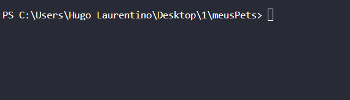

<h1 align="center">
  
</h1>

- [x] Bak-End
- [x] Criar Título
- [x] Criar Descrição
- [x] Sobre
- [x] Tecnologia
- [x] Pre requisito
- [x] Autor
- [x] GIF‘s

---
<h1 align='center'>Meus pets</h1>

<p align='center'>Esse é um exemplo de lógica em javascript</p>
<p align='center'>
</p>

<p align='center'>
 <a href='#sobre'>Sobre</a> |
 <a href='#pré-requisitos'>Pre Requisitos</a> |
 <a href='#tecnologias'>Tecnologias</a> |
 <a href='#autor'>Autor</a>
</p>

---
<h1 align='center'>
 
</h1>
<p align='center'>
Lista (Array) de objetos usuarios, for e ternário
</p>
---

### Sobre

  <p align= 'justify'>
  Neste programa é feito para contar quantos pets tem um usuário, para isso preciso entra na lista de usuarios, depois entra em uma lista de pets que esta dentro do objetos.
  Usei for (loop), ternário e template string para mostra os frases:
  Sou Hugo e não tenho pets
  Sou Enrique e tenho 3 pets
  Sou Ana e  tenho 1 pet
</p>

---

### Pré-requisitos

Antes de começar, você vai precisar ter instalado em sua máquina as seguintes FERRAMENTAS: [GIT](https://git-scm.com/), [Node.js](https://nodejs.org/en/download).
Além disto é bom ter um editor para trabalhar com o código como [VSCode](https://code.visualstudio.com/download).

### 🎲 Rodando o Back End

```bash
# Clone este repositório
$ git clone https://github.com/hugolaurentino/meusPets.git

# Acesse a pasta do projeto no terminal/cmd
$ cd meusPets

# Instale as dependências
$ npm install

# Execute 
$ node .\meusPets.js

```
### Tecnologias

As seguintes ferramentas foram usadas na construção do projeto:

- [Node.js][nodejs]

---
###### tags: `JavaScript` `nodeJS` `backend` `lógica` 
## Autor
Feito com ❤️ por Hugo Laurentino 👋🏽 [Entre em contato!](https://www.linkedin.com/in/hugo-laurentino-silva/)

[nodejs]: https://nodejs.org/
